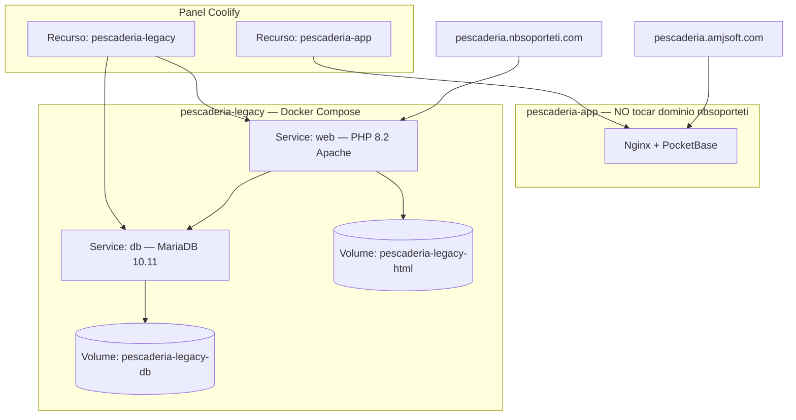

# Pescadería legado en Coolify (vista gráfica)

Objetivo: ver y operar **`https://pescaderia.nbsoporteti.com`** (PHP + MariaDB) desde el panel de Coolify, **separado** de **`pescaderia.amjsoft.com`** (app nueva PocketBase).

Repositorio: **`git@github.com:nbsoporteti/pescaderia-legacy.git`**

## Cómo se ve en Coolify (mapa)



| En el panel | Qué es | Dominio |
|-------------|--------|---------|
| **pescaderia-app** | Sistema nuevo | Solo `pescaderia.amjsoft.com` |
| **pescaderia-legacy** | Este repo (Docker Compose) | Solo `pescaderia.nbsoporteti.com` |

> Si en `pescaderia-app` aparecen **los dos dominios** en Traefik, un redeploy puede mandar tráfico al sitio equivocado. Dejá un dominio por recurso (ver `scripts/revert-pescaderia-traefik.py`).

---

## Crear el recurso en Coolify (paso a paso)

### 1. Nuevo recurso

1. Coolify → **+ Add New Resource**
2. Tipo: **Docker Compose**
3. **Source**: `nbsoporteti/pescaderia-legacy`, rama `main`
4. **Compose location**: `docker-compose.yaml` (raíz del repo)
5. Nombre sugerido: **`pescaderia-legacy`**

### 2. Variables de entorno

Copiar de `.env.example`:

| Variable | Valor |
|----------|--------|
| `MYSQL_ROOT_PASSWORD` | Clave fuerte |
| `MYSQL_USER` | `pescaderia` |
| `MYSQL_PASSWORD` | Clave de app |
| `MYSQL_DATABASE` | `pescaderia` |
| `DB_NAME` | `u207708227_pesquera` |

### 3. Red

**Connect to Predefined Network** → **`coolify`**

### 4. Volúmenes persistentes

| Servicio | Ruta en contenedor | Nombre |
|----------|-------------------|--------|
| `db` | `/var/lib/mysql` | `pescaderia-legacy-db` |
| `web` | `/var/www/html` | `pescaderia-legacy-html` |

### 5. Dominio

Servicio **`web`** → **Domains** → `https://pescaderia.nbsoporteti.com`, puerto **80**, SSL Let's Encrypt.

### 6. Deploy

**Deploy** → estado **Running**. Logs, terminal y restart por servicio en la UI.

---

## PHP y base (después del deploy)

```bash
./scripts/import-backup.sh backup.sql
./scripts/deploy-html.sh public_html.zip
./scripts/patch-connect.sh
./scripts/verify-db.sh
```

---

## Checklist

- [ ] Recurso **pescaderia-legacy** creado desde este repo
- [ ] `pescaderia-app` solo con `pescaderia.amjsoft.com`
- [ ] Volúmenes DB + HTML
- [ ] Dominio `pescaderia.nbsoporteti.com` en **web**
- [ ] Login PHP OK
